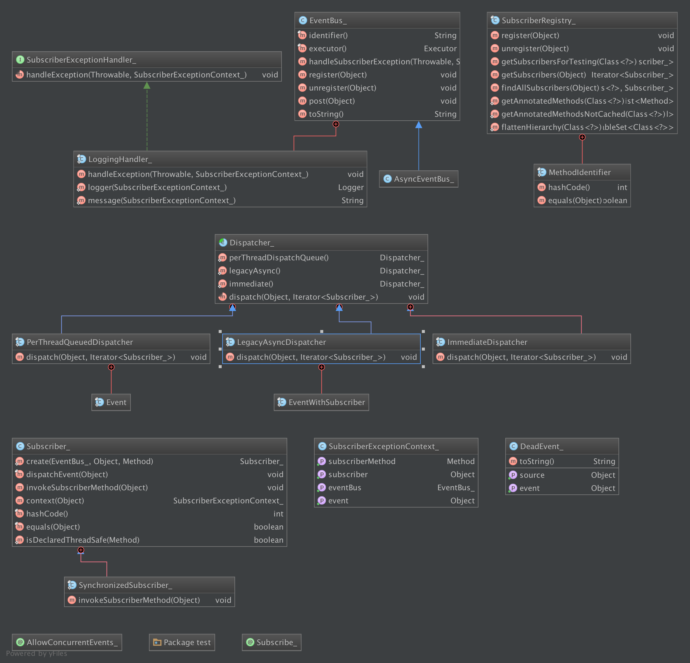
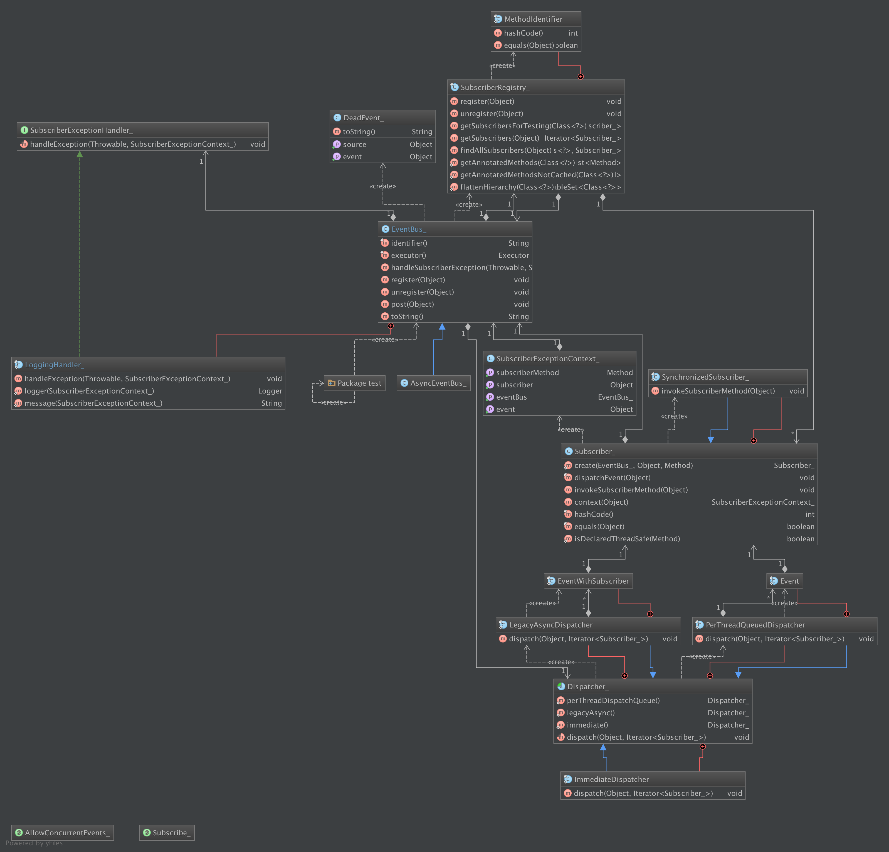

# Guava-Event-Bus 学习笔记
Guava的EventBus源码学习，基于Guava的18.0版本
> 分析者：[Allen](https://github.com/qq291462491)
		
###1. 背景简介
EventBus是google的一个Java工具包其中的一个工具类，类似的有多个版本其中包括移植到Android端的[greenrobot-EventBus](https://github.com/greenrobot/EventBus)
和改良的[square-otto](https://github.com/square/otto)，功能基本都是一样的。此处主要是对Guava版的EventBus分析，关于[guava代码地址](https://github.com/google/guava)。

###2. 功能简介     
####2.1 EventBus介绍
EventBus 是一个基于事件的一个发布/订阅框架，通过解耦发布者和订阅者简化事件传递，这里的事件可以理解为消息，本文中统一称为事件也就是 Event。通过EventBus可以简化生产者/消费者
这种模型，同时又可以通过Executor来控制线程，使用起来非常优雅灵活。异步的则使用AsyncEventBus，如果需要强制使EventBus同步执行则可以使用`@AllowConcurrentEvent`注释方法。

####2.2 关键词
**事件(Event)：**又可称为消息，本文中统一用事件表示。其实就是一个对象，可以是网络请求返回的字符串，也可以是某个开关状态等等，用于订阅者和发布者之间的消息传递媒介。`事件类型(EventType)`可以自由定义，一般是一个消息对象。
例如：
```java
public class MessageEvent {

    private String message;

    public MessageEvent(String message){
        this.message = message;
    }

    public String getMessage() {
        return message;
    }
}
```
EventBus支持一个订阅者来订阅多个类型的事件，Event的子类也可以被传递。  

**订阅者(Subscriber)：**订阅某种事件类型的对象，使用`@Subscribe`注解来标明一个方法是用于订阅事件的方法。当有发布者发布这类事件后，被加注解的方法便可以执行，`事件响应函数`。
使用EventBus将订阅者通过 register 接口订阅来定义，unregister 接口退订。  

**发布者(Publisher)：**发布某事件的对象，注册完订阅者之后便可以使用EventBus的 post方法来发布消息，每个消息仅被接收处理一次。 

**无关事件(DeadEvent)：**如果EventBus发送的消息都不是订阅者关心的称之为Dead Event，这时我们可以通过log的方式来记录这种状态。

###3. 总体设计
####3.1 类图设计
> ps:忽略类名后的下划线     

#####3.1.1 EventBus简要类图
 
#####3.1.2 EventBus详细类图
  
####3.2 流程设计
#####3.2.1 创建流程
#####3.2.2 regist流程
#####3.2.3 unregist流程
#####3.2.4 post流程
###4. 源码详细分析
**线程安全注解：** `AllowConcurrentEvents`
**方法订阅注解：** `Subscribe`
**消息总线：** `EventBus`
**异步消息总线：** `AsyncEventBus`
**分发器：** `Dispatcher`
**DeadEvent：** `DeadEvent`
**订阅者：** `Subscriber`
**订阅者注册表：** `SubscriberRegistry`
**异常上下文：** `SubscriberExceptionContext`
**异常Handler：** `SubscriberExceptionHandler`


###5. 总结
####5.1 并发编程，JDK并发包Executor
####5.2 guava断言checkNotNull
####5.3 静态导入
####5.4 注解方法cache
####5.5 缓存配置ImmutableList不可变list
####5.6 获取类型TypeToken
####5.7 ThreadLocal


```xml 
<dependency>
	<groupId>com.google.guava</groupId>
	<artifactId>guava</artifactId>
	<version>18.0</version>
</dependency>
```	